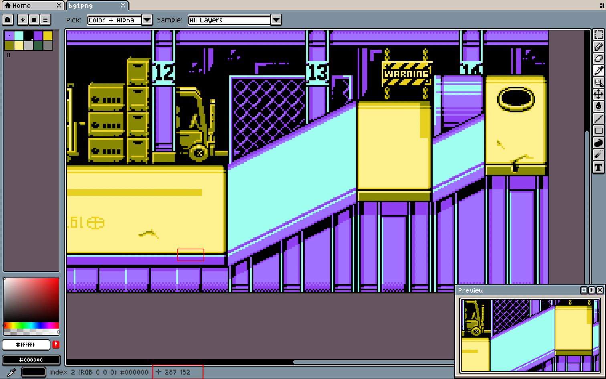
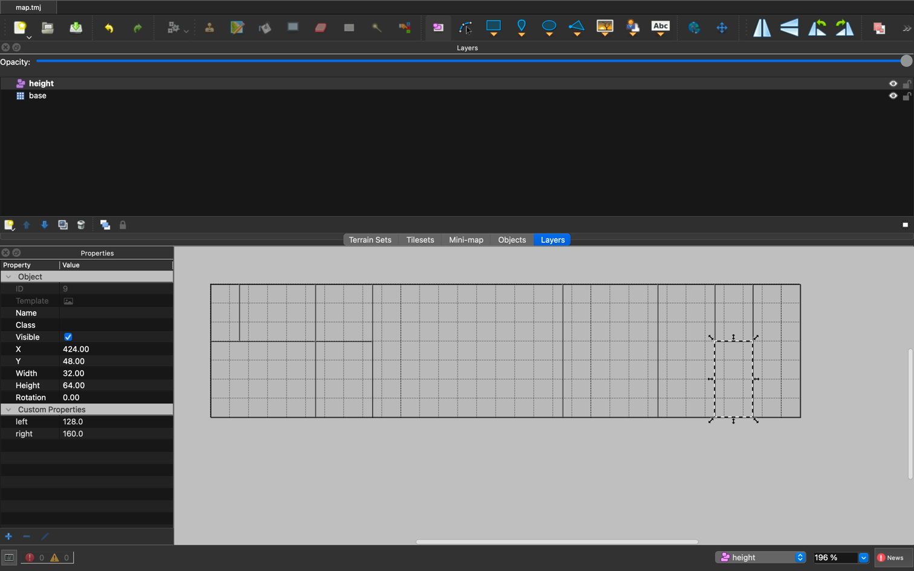
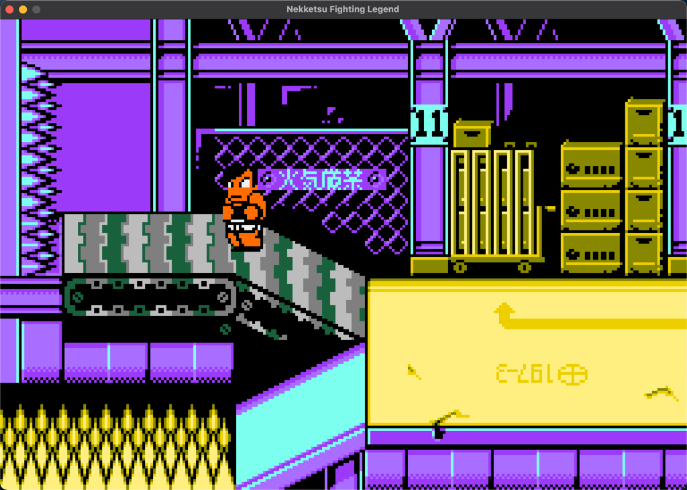

y(深度)轴与z(高度)轴缩放为原来的 1/2  
对着地图按像素与缩放规则绘制高度图，有特殊区域也可以进行标注
 
通过 RangeManager 获取目标点的高度进行移动落地判断 
各种特殊 range 判断用户是否处于其上面 只需要判断用户 x y 在其内部且 z 在其表面一定距离即可
 
效果

https://github.com/user-attachments/assets/2cb9ca4d-8936-4cc6-9d6d-a58f6f9626d2
